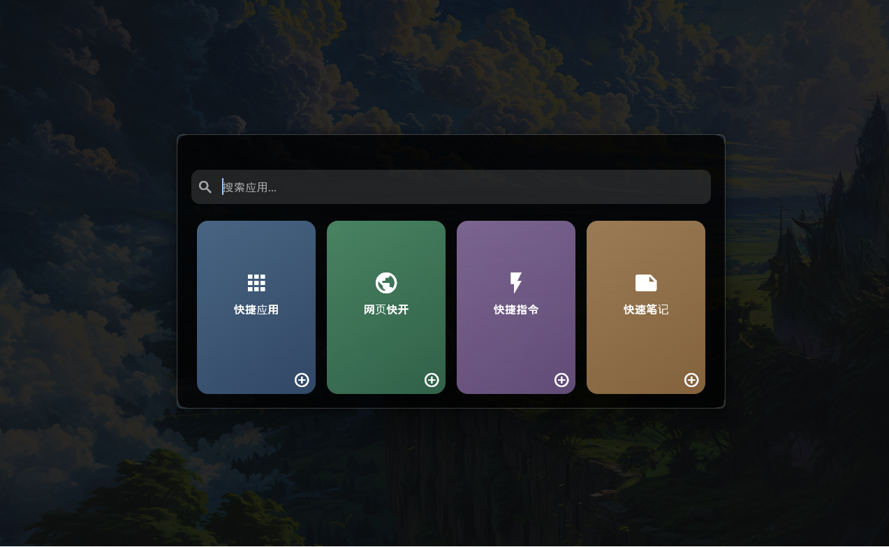
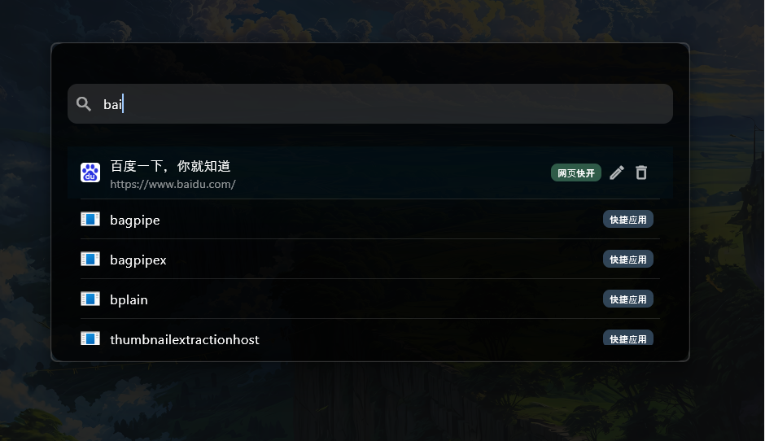
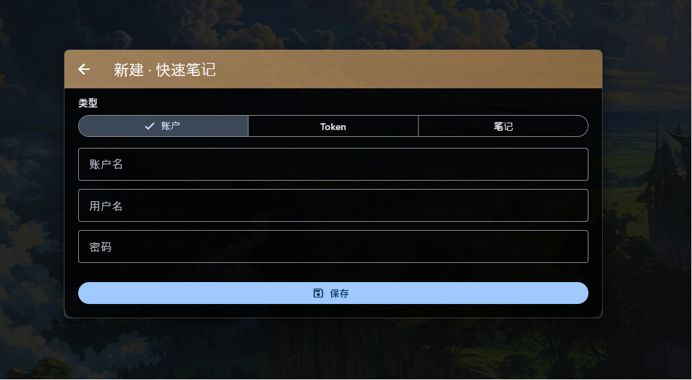

<div align="center">


# Quick Box

**一款轻量、毛玻璃风格的桌面快速启动与收藏工具 · 基于 Flutter**  
*A lightweight frosted-glass desktop launcher and stash — built with Flutter*

**Language / 语言 ·** [简体中文](#lang-zh-cn) · [English](#lang-en)

</div>

---

<a id="lang-zh-cn"></a>

## 简体中文

### 简介

**Quick Box** 是运行在 **Windows** 上的桌面小工具：全局快捷键呼出半透明窗口，用一块搜索区串联「快捷应用、网页快开、快捷指令、快速笔记」等卡片，并支持拼音与模糊检索、S3 兼容对象存储同步（网页 / 指令 / 笔记，不含快捷应用列表）。

### 截图

<p align="center">
  <b>主界面</b><br />
  
</p>

<p align="center">
  <b>全局搜索结果</b>（四张卡片条目统一检索，结果带卡片类型标签）<br />
  
</p>

<p align="center">
  <b>创建快速笔记</b>（结构化笔记表单）<br />
  
</p>

### 主要特性

| 能力 | 说明 |
|------|------|
| **全局热键** | 显示/隐藏主窗口、窗口居中、为四张卡片单独绑定快捷键 |
| **混合搜索** | 中文、拼音简拼/全拼、模糊与排序，快捷找应用与自定义条目 |
| **四张卡片** | 应用索引、网页（含 favicon 等）、命令行、结构化笔记 |
| **毛玻璃 UI** | 圆角、模糊背景，适合搭在其它窗口之上使用 |
| **托盘** | 后台驻留，从托盘打开设置或退出 |
| **数据目录** | 可自定义数据根路径，索引与用户条目落盘 |
| **云同步** | S3 兼容 OSS（如阿里云、MinIO）；启动拉取、本地变更防抖上传、设置页手动下载 |

### 环境要求

- Windows 10 / 11（x64）
- [Flutter](https://flutter.dev/) 稳定版（建议与 `pubspec.yaml` 中 SDK 约束一致，当前为 **Dart ^3.11**）

### 运行项目

```bash
flutter pub get
flutter run -d windows
```

发布构建示例：

```bash
flutter build windows
```

### 云同步说明

- 需在 **设置 → 云同步** 中填写 Endpoint、Bucket、访问密钥等并**开启**开关。
- 同步范围：**网页快开、快捷指令、快速笔记**；**不包含**「快捷应用」用户条目。
- 凭据保存在本机 SharedPreferences，请妥善保管设备与账号权限。

### 目录结构（节选）

```
lib/
  main.dart                 # 入口、窗口与托盘
  pages/                    # 设置、表单等页面
  cards/                    # 各卡片与交互
  services/                 # 设置、存储、索引、云同步、混合搜索等
assets/
  qb.png                    # 应用图标资源
docs/
  example1.png              # 主界面
  example2.png              # 搜索结果
  example3.png              # 创建快速笔记
```

<p align="right"><a href="#">↑ 返回顶部</a> · <a href="#lang-en">English →</a></p>

---

<a id="lang-en"></a>

## English

### Overview

**Quick Box** is a lightweight **Windows** desktop utility: invoke a frosted-glass popup via global hotkeys, search across **Quick Apps, Web Shortcuts, Commands, and Notes** in one place, with pinyin-aware fuzzy ranking, and optional **S3-compatible cloud sync** for web/command/note data (Quick Apps user list stays local).

### Screenshots

<p align="center">
  <b>Main window</b><br />
  
</p>

<p align="center">
  <b>Global search</b> (results across all cards, with card-type badges)<br />
  
</p>

<p align="center">
  <b>New quick note</b> (structured note form)<br />
  
</p>

### Highlights

| Capability | Description |
|------------|-------------|
| **Global hotkeys** | Show/hide, center window, per-card shortcuts |
| **Hybrid search** | Chinese, pinyin, fuzzy matching and ranking |
| **Four cards** | App index, web (favicon, etc.), shell commands, structured notes |
| **Frosted UI** | Blurred, rounded window suited for overlay use |
| **System tray** | Background stay; open settings or exit from tray |
| **Data root** | Configurable folder for index + `user_entries.json` |
| **Cloud sync** | S3-compatible storage; pull on startup, debounced push on change, manual download in Settings |

### Requirements

- Windows 10 / 11 (x64)
- [Flutter](https://flutter.dev/) stable channel (**Dart ^3.11** per `pubspec.yaml`)

### Run

```bash
flutter pub get
flutter run -d windows
```

Release build:

```bash
flutter build windows
```

### Cloud sync

- Configure **Settings → Cloud Sync** (endpoint, bucket, keys) and **enable** the toggle.
- Synced scope: **web shortcuts, commands, notes** only — **not** the Quick Apps user list.
- Credentials are stored locally (e.g. SharedPreferences); protect your machine and IAM policies.

### Repository layout (excerpt)

```
lib/
  main.dart
  pages/
  cards/
  services/
assets/
  qb.png
docs/
  example1.png
  example2.png
  example3.png
```

<p align="right"><a href="#">↑ Top</a> · <a href="#lang-zh-cn">← 简体中文</a></p>

---

<div align="center">

**Quick Box** — 让常用能力近在手边 · Keep your shortcuts one keystroke away.

</div>
